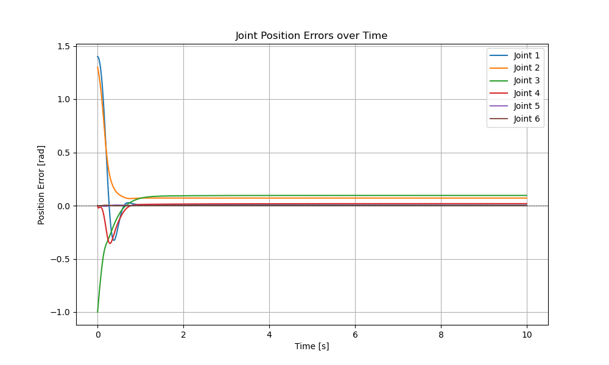
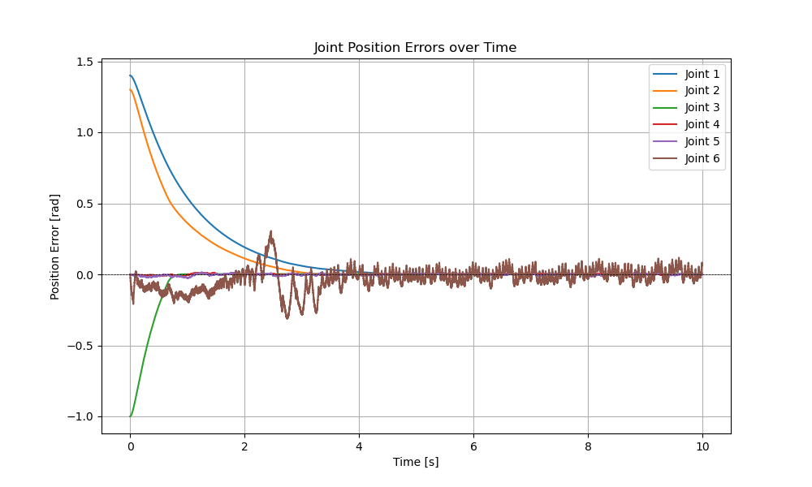
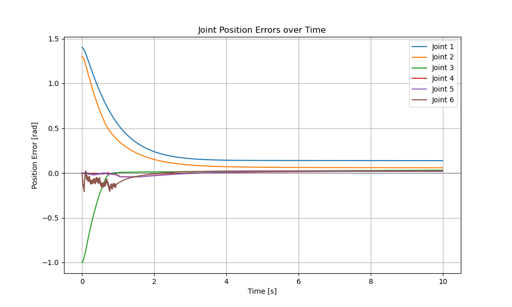

# Sliding Mode control

This repo is a copy of [forc](https://github.com/simeon-ned/forc/tree/master) and contains the implementation of Sliding Mode control.

## Navigation

- Videos are saved in `logs/videos/`. The solution for Sliding Mode controller is in `05_set_parameters.py`.
- Plots are saved in `logs/plots/`.
- All my notes and equations are in `notes/final.pdf`.
- All examples use the UR5e robot model.

The structure of the repository is as follows:
```bash
├── logs/
│ ├── videos/ # Simulation recordings
│ └── plots/ # Generated plots
├── robots/ # Robot models
└── simulator/ # Simulator class
└── notes/ # Equations taken from lectures and all math presented here
```

## Results

The sliding mode controller was implemented and its gains were tuned as a result of this task. Also the boundary layer with thickness $\Phi$ was proposed. 

Sliding mode controller results and comparison woth simple Inverse Dynamics sontroller can be seen below:

Position error of PD controller with additional mass:


Position error of Sliding Mode controller with additional mass:


Graphs above show that simple PD controller has constant gains, therefore it can't achieve desired control to reach the goal. But Sliding Mode controller converges to desired joint positions even with additional mass. 

Position error of Sliding Mode Smoothed controller with  additional mass:


For the $\Phi=10$ it can be seen that chattering disappears, but robustness decreases and joints do not achieve target positions. For the lower values chattering increases. So, one can change three parameters: l, k, Phi in code to achieve the best performance for the target task. 
